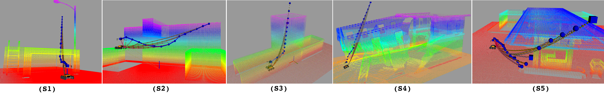

# marsupial_optimizer based on cerec-solver

Testing 

This package provides a framework to solve non-linear optimization problem for 3D trajectory planning in a marsupial robot configuration. Specifically, the configuration consists of an unmanned aerial vehicle (UAV) tied to an unmanned ground vehicle (UGV). The result is a collision-free trajectory for UAV and tether.

<p align="center">
    
</p>

The optimization assumes static UGV position ,and estimates the problem states such as UAV and tether related with: UAV  position,  tether length, and UAV trajectory time. 

Different components such as UAV and tether positions, distance obstacles and temporal aspects of the motion (velocities and accelerations) are encoded as constraint and objective function. In consequence, the problem determining the values of the states optimizing a weighted multi-objective function.

The components encoded as constraint and objective function are local with respect to the problem states. Thus, the optimization is solved by formulating the problem as a sparse factor graph. For that g2o is used as the engine for graph optimization [https://github.com/RainerKuemmerle/g2o].

## Installation

In this section you will find the installation instructions for making it work. The next section (prerequisites) tells you the environment in which the package has been tested.

### Prerrequisites and dependencies


### Installation steps:

1- Clone this repository into the source of your catkin workspace. Please refer to http://wiki.ros.org/catkin/Tutorials/create_a_workspace to setup a new workspace.

2- Call marsupial_setup.sh script from ```marsupial_g2o/script``` directory to install package dependencies.

```
rosrun marsupial_g2o marsupial_setup.sh
```

3- Call the g2o_installation.sh script to install G2O required dependencies (will be install in ```/home/$user/```).

```
rosrun marsupial_g2o g2o_installation.sh
```

4- Finally compile your workspace using ```catkin_make``` 

## Usage

Five scenarios with different features can be set to use the optimizer. S1: Open environment, S2: Narrow/constrained environment, S3: Confined environment, S4: Confined environment, S5: Open environment, as show in the next figure.

<p align="center">
    
</p>

The package has a set of predefined configurations (and completely extendable according to the user's need) that relate the stage number, initial position number and goal position number. The set of initial positions can be check in ```/cfg``` and the goal positions in ```/trees/resources/```.

To launch the optimizer just launch the provided ```launch/marsupial_optimization_trayectory.launch``` file. To manage the scenario and initial position predefined is recommend to use the parameter for this launch, ```scenario_number``` and ```num_pos_initial```. Thus, for example to use S2 and initial position 2: 

```
roslaunch marsupial_g2o marsupial_optimization_trayectory.launch scenario_number:=2 num_pos_initial:=2
```

It will launch the optimizer and the visualization of the environment and marsupial robots in RVIZ. 

To start the optimization process is necessary to publish a desired goal position in the topic ```/Make_Plan/goal```.
